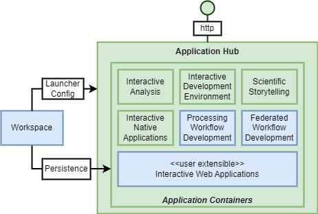

# Application Hub Building Block

The Application Hub is a general capability through which web-enabled interactive applications can be hosted and exposed as web applications. The application framework acts as a web-facing entrypoint through which an extensible set of applications are exposed – extensible through custom configuration.

The Application Hub should support a number of different types of application:

* **Tools for Interactive Analysis** 
  Web-enabled interactive analysis environment for real-time programmatic interaction with the data and service of the platform – for example Jupyter Lab/Notebooks.

* **Tools for Processing Workflow Development** 
  Web-enabled interactive applications to facilitate application development to facilitate the transition of code from analysis to production-ready application. The Development Tools should provide:

    * Web IDE for coding in the popular languages for data science
    * Management and testing of container images (interfacing with container registries)
    * The Application Hub should also support the integration of specific tooling for interactive creation of Processing Workflows, including Application Package CWL, and openEO Process Graph. 
      The expectation is that this specific tooling will be contributed as part of the development of the Processing Building Blocks.

* **Scientific Storytelling** 
  Stories are scientific narratives that are seen as a great means to publish results of scientific research, particularly to the general public. For example, the open-source library eodash (https://github.com/eurodatacube/eodash) – offered via Jupyter notebooks.

* **Interactive Dashboards** 
  Dashboards are web applications that typically rely upon platform services to interactively visualise EO data and service insights - that can be used to present actionable information through intuitive interactive user interfaces – e.g. created using packages streamlit and Voila.

* **Interactive Graphical Web Applications** 
  A generalised capability to expose interactive web applications that interface with the processing and data offering of the underlying platform and/or workspace resources. Interactive Dashboards can be see as a specific example.

* **Interactive Graphical Native Applications** 
  Access to native applications, such as QGIS, SNAP etc., running in the platform and accessed using a web-based remote desktop (web-RDP) approach.

The Application Hub should integrate with the Workspace building block in order to customise the environment for each user, including:

* Configure a customised set of applications to expose through their Application Hub launcher
* Connect with storage to establish persistence for the user’s work within the Application Hub
* Connect with source code repositories the user has registered
