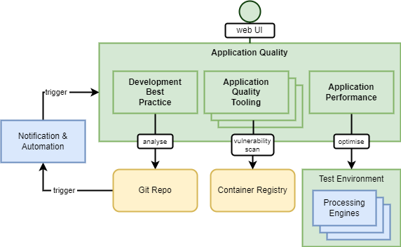

# Application Quality Architecture

**See also the [Detailed Application Quality Design](/projects/application-quality)**

## Overview

The goal of the Application Quality BB is to support the evolution of a scientific algorithm (processing workflow) from a research project to one that can be utilised in a production environment. To achieve this, the Application Quality BB provides tools to support verifying non-functional requirements - including code quality, software development best practice for open reproducible science, and optimisation through performance testing.

The Application Quality BB delivers a set of services that can be used in automated pipelines that are linked to the source and runtime resources of processing workflow developments. Dedicated test environments provide representative sandboxed execution services that can be used as a gateway to production.

{: .centered}

## Components

The Application Quality BB design should follow a modular approach through components that implement specific capabilities.

### Development Best Practice

**_Analysis of source code and repositories for code quality, and adherence to development best practices for reproducible open science._**

Development Best Practice provides a set of services that users can link to their development resources – for example, connecting the tooling to their Git and container image repositories. Static Code Analysis tooling (e.g. SonarQube) can be used to analyse connected git repositories, report code quality issues, detect security vulnerabilities and advise best practice.

### Application Quality Tooling

**_Extensible set of additional tooling for application quality that can be integrated into automated development pipelines._**

Extensible set of tooling that complement the Development Best Practice component, and can be integrated in the Application Quality BB automated pipelines. Examples include vulnerability scanning of application runtime artefacts, such as containers.

### Application Performance

**_Tooling to support performance testing and optimisation of processing workflows, supported by test execution environments._**

Application Performance provides an environment in which processing workflows can be tested (executed). This test environment should be sandboxed for development, such that it cannot impact operational systems. The test environment should provide support for profiling, identifying bottlenecks and optimising application code.

### Web-enabled UI

The Application Quality BB should provide a web UI through which the tooling is accessed.

## Pipeline Automation

The Application Quality BB should support automation triggered by updates to the applications resources (git, containers, etc.). This can be achieved by integration with the Notification & Automation BB.
