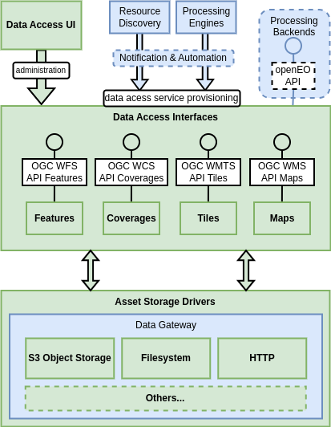

# Data Access Building Block

## Overview

Data Access are seen as a set of services that can be optionally ‘attached’ to datasets – typically those that are registered in the Resource Discovery (including Workspace), including results from Workflow execution – e.g. visualise results from OAPIP application package, or attach as a ‘service’ to openEO results.

Datasets are registered and discovered through the Resource Discovery component, with the expectation that the underlying data will be held in S3 object storage. Data Access provides a set of standard interfaces through which the datasets can be consumed – defining a common approach for consumption across data providers.

{: .centered}

The standard interfaces for data access include…

*	Features: OGC WFS / API Features
*	Visualisation: OGC WMTS / WMS / API Tiles / API Maps
*	Retrieval: OGC WCS / API Coverages
*	Interfaces linked to Processing Backends, such as those offered by openEO ‘secondary services’ [[RD21]][rd21]

For access to data assets, the Data Access should integrate with data sources that include: S3 object storage, HTTP, Filesystem (POSIX), and optionally Swift object storage.

## Components

The Data Access design should follow a modular approach that is extensible through components that implement specific capabilities.

### Data Access Interfaces

**_Provides the service APIs for data access and visualisation with an extensible design._**

Implementations should be provided for Features, Coverages, Tiles and Maps – with scope for future extensibility of interfaces supported.

### Asset Storage Drivers

**_Designed to be plugged-in to provide access to specific storage services._**

Implementations should be provided for S3 object storage, HTTP, and file-system (POSIX) - with scope for future extensibility of interfaces supported.

#### Data Gateway Reuse

See section [Data Access BB dependency on the Data Gateway][data-access-bb-usage].

The implementation of the Asset Storage Driver components may be partly or wholly met by the capabilities of the [**Data Gateway**][data-gateway-building-block] building block, that is designed to provide a reusable/extensible implementation that encapsulates the interface with the data providers.

It is anticipated that the _Harvester_ component will use the Data Gateway to source the products that are registered in the platform services. Similarly, the Data Access BB can rely upon the Data Gateway for retrieval of the corresponding assets (using the same data provider) - thus benefitting from the consolidated solution for data provider integration.

The Data Gateway provides access to the (raw) assets that are referenced from the product metadata - which facilitates their retrieval and delivery via the data access services.

### Data Access UI

Web-enabled UI providing administrative access to the capabilities of the Data Access BB.

## Dataset Service Selection

It is anticipated that datasets will not routinely require all/any of these dataset services. Thus, datasets requiring data access service support will be marked as such in their Resource Catalogue metadata record – detailing the services required. The Data Access integrates with the Notification & Automation BB to receive notifications of catalogue dataset metadata updates in order make data access services available in accordance with the dataset metadata specification.

## Processing Backend Service Integration

The Data Access services should be available for integration as a service with Processing Backend implementation engines whose APIs support data access services. For example, openEO has a capability that allows results to be offered through OGC services, such as WMS for visualisation. The Data Access building-block should be reusable in this context.
