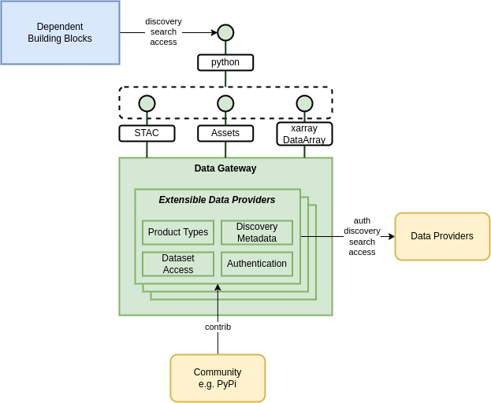

# Data Gateway Architecture

**See also the [Detailed Data Gateway Design](/technical/data-gateway-bb)**

## Overview

The Data Gateway building block provides a consolidated and consistent capability for accessing the data offering of an extensible set of data providers and datasets.

Within the architecture there are a number of points of interaction with data sources for discovery and access to datasets and data products. Each _Data Provider/Dataset_ has their own specific rules-of-engagement that must be uniquely taken into account...

* Interfaces/standards for discovery, metadata search and data retrieval
* Metadata and data formats
* Delivery of data assets from underlying storage
* Approach to user identity, authentication and authorization

**_Rather than implement the logic required for specific data source interaction in each BB where it is required - instead the Data Gateway provides a consolidated implementation that all platform services can reuse and exploit as they require. In this way, the interface with each data provider is only implemented once, and there is only one implementation that requires maintenance in the case that the data provider interface evolves._**{ .blue-text }

### Capabilities

To support the needs of the dependent building blocks, the Data Gateway provides the following capabilities:

* Discover data providers
* Discover product types 
  _Retrieve full product metadata_
* Search products 
  _By type and temporal/spatial search criteria, plus other properties for filtering_
* Retrieve products (raw assets)
* Multi-dimensional data representation (`xarray.DataArray`)

See section [Dependent Building Blocks][dependent-building-blocks] - which elaborates the usage of the Data Gateway by other building blocks.

!!! note
    The Data Gateway must adapt to the emerging requirements of the building blocks regarding interfacing with data providers and datasets, including:

    * Addition of new data providers and datasets
    * Additional representations of product metadata and data products - to satisfy sepcific BB use cases

### Extensible

To support an ever growing set of data sources, the Data Gateway must be extensible for:

* Data providers and datasets
* Authentication approach
* Search interface protocol/standard
* Data retrieval approach/standard
* Metadata and data product representation

## Approach

The Data Gateway provides a singluar, reusable point of interface with an extensible capability of integrated data source offerings.

{: .centered}

### Embeddable

This capability is designed to be embeddable/invocable from a number of other building blocks that reuse its capability, including:

* **Resource Registration (Harvester component)** 
  *For harvesting and registration of data products*

* **Processing Engine** 
  *For preparation and access to input data for processing workflows.*

* **Data Access** 
  *For retrieval of dataset assets into the services for data visualisation and access.*

* **Datacube Access** 
  *For discovery and access to multi-dimensional data, including for consumption as `xarray.DataArray`.*

* **Federated Orchestrator** 
  *For discovery and access to datasets across a federated set of platforms and data providers.*

To support inclusion in the capabilities these BBs, the Data Gateway shall provide a programmtic library (at least python) to support inline integration.

### Dataset Representation

#### STAC

The Data Gateway presents the offering of each dataset as STAC items - regardless of underlying technology capability of the data provider itself.

The STAC items include (as approriate) `asset` links...

* Either, remote (network) URLs (`http(s)`/`s3`)
* Or, a fully hydrated local representation, with all assets retrieved for local filesystem access

Thus, the Data Gateway is able to present a standard STAC interface for each dataset - which provides a simplified approach for the other building blocks, that can use STAC semantics regardless of the data source.

#### Data Cube

The Data Gateway should also provide a data cube semantic, by offering a dataset representation as an `xarray.DataArray`.

This facilitates, for example, integration of the data layer with pangeo stack.

## Dependent Building Blocks

This section introduces the other building blocks that are expected to utilise the Data Gateway building block.

The ability of the Data Gateway to be extended to support additional data sources (providers) is intended to help meet the extensibility needs of these components.

### Harvester Data Sources Usage

**_Component of the Resource Registration BB_**{ .blue-text }

The Harvester Data Source components are designed to provide an integration with specific data sources to provide customised support for record harvesting and interpretation.

The idea is that the Harvester Data Sources are designed to be plugged into the Harvester component to integrate harvesting with an extensible set of data sources.

Thus, the Data Gateway provides an established set of data providers from which to harvest, and a consistent approach to interfacing with the discovery metadata of those providers, for the purposes of harvesting and registering the data products in the relevant platform services - such as _Resource Discovery_ and _Data Access_. In addition, if required, the Data Gateway also facilitates the retrieval of assets that may be necessary to fully hydrate the product metadata.

The Data Gateway approach facilitates expansion of the list of supported providers for data harvesting - e.g. by community plugins etc.

### Processing Data Sources Usage

**_Component of the Processing BB_**{ .blue-text }

The Processing Data Source components provide an integration with a data provider to make the dataset available as a processing workflow input.

Designed to be plugged-in to the Processing Engine/Runner for a given deployment - the Processing Data Sources interface with the data source to make available the data inputs and present them in a standard format (STAC) for consumption by the processing workflows.

There is a dependency between the processing workflow and the data upon which it is designed to operate. The Processing Data Sources facilitate the ability of the Processing Engine/Runner to deliver the input data to the processing workflow in the expected form. Typically the processing input data is presented as data assets referenced via STAC catalog/items.

The Data Gateway contributes to the provision of Processing Data Sources by providing...

* A consistent means for identifying both data provider and datasets for processing inputs – such that a given processing workflow can be ‘verified’ against specified dataset/provider combinations
* A consistent approach for selection and retrieval of assets
* Extensibility to add more data providers

The expectation is that the Data Gateway provides a means to obtain a STAC representation of the input data, with local or remote asset links. This supports the staging of input data for processing workflows - as described in the [OGC Best Practice for Application Packages (EO Products Data Flow Management)](https://docs.ogc.org/bp/20-089r1.html#_eo_products_data_flow_management).

Different deployments of the Processing Service (e.g. in different platforms), can be provisioned with a Data Gateway that is configured with different sets of data-provider/dataset they choose to support.

### Data Access BB Usage

The data access BB will receive the STAC items from the harvester from which it will register data products into its services (retrieval/visualisation etc.). In doing so it will access the data assets as referenced by the links in the STAC items, via S3 etc.

The Harvester will have used the Data Gateway in the first instance to discover the products and interface with the data provider - outputting the STAC items for registration.

It may therefore be desirable for the Data Access BB to rely, where appropriate, upon the Data Gateway for retrieval of the corresponding assets - thus benefitting from the consolidated solution for data provider integration. Reusing the Data Gateway in this way provides consistency of approach (i.e. reusing the same data provider implementation used for harvesting) and ensures that the Data Access benefits from the extensibility and maintenance afforded to the Data Gateway.

### Datacube Access BB Usage

The Datacube Access BB provides ‘pixel-based’ access to multidimensional data in accordance with the emerging OGC GeoDatacube API (ref. Testbed-19). The goal of this API is to harmonise access to multidimensional data – and in doing so facilitate fusion of data from multiple sources by allowing alignment of units, geometries, references systems, etc.

Underlying the implementation of the Datacube Access BB is the need to enumerate and access the data product assets. The Datacube Access BB can benefit from the common implementation of the interface with the data source provided by the Data Gateway BB. In addition, the ability of the Data Gateway to offer an `xarray.DataArray` representation should offer an additional benefit.

### Federated Orchestrator BB Usage

The Federated Orchestrator provides a Workflow API that is designed to exploit the collective data and processing capabilities of multiple platforms operating within a distributed federated environment. In this context, the Federated Orchestrator is required to hold a view of the capabilities on offer within the federated network.

The Data Gateway is able to support the Federated Orchestrator in presenting the federated data offering as a homogeneous set. Thus, users of the Federated Orchestrator, via its API, can discover, search and filter available data - regardless of the source data provider. The Federated Orchestrator is then able to apply business logic that determines the most appropriate data source for a given user dataset request, in combination with other concerns such as workflow engine capabilities - and so orchestrate the federated workflow appropriately.
