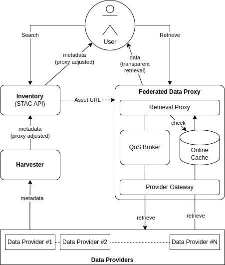

# Federated Data Proxy Architecture

## Overview

The Federated Data Proxy allows a platform to serve data from multiple (internal and external) providers, in such a way that is transparent to the service end-users.

The platform offers an Inventory (STAC Catalogue) to its users that enumerates all the available (online and offline) datasets, including those that are hosted in external data providers. In this case there are a range of approaches for handling access to the offline/external data, that must be taken into account:

1. Data is routinely harvested and re-hosted
2. Selected data is routinely harvested according to a criteria 
   _e.g. rolling last N months data over a geographic region_
3. Data is retrieved on-demand
4. Data is ordered for subsequent asynchronous access 
   _This includes requests for data from Long-term Archive_
5. On-demand data is maintained in a online cache

The Federated Data Proxy offers a single point of access that transparanerly satisfies each of these data management approaches.

## Approach

The Federated Data Proxy provides an 'access middleware' endpoint that transparently interfaces with each upstream data provider - including both internal and external data sources.

{: .centered}

The Inventory maintains asset `href` that resolve to the Federated Data Proxy endpoint - rather than to the upstream data provider. 

The user searches the Inventory via its STAC API to discover data of interest, and then follows the provided assest urls to request data retrieval. These requests go via the Federated Data Proxy which integrates with the data provider to satisfy the request.

The URLs served by the Federated Data Proxy correspond to the datasets and assets that are available in the upstream data providers. The URLs are designed to be transparent regarding the need or otherwise to retrieve the product from the upstream - including the following possible retrieval responses:

* Redirect to the asset directly in the upstream provider
* Synchronous delivery of the requested data from the online cache
* Synchronous delivery of the requested data - following retrieval from the upstream
* Asynchronous delivery of the requested data - following retrieval from the upstream

The URL encodes sufficient information for the Federated Data Proxy to marshall the retrieval appropriate upstream provider.

## Inventory (STAC Catalogue)

The use of the Federated Data Proxy as an 'access middleware' relies upon the Inventory being maintained with appropriate metadata, whose URLs direct retrieval requests to the Federated Data Proxy.

> It is anticipated that this responsibility is placed on the platform's harvesting subsystem - whose role is to interface with upstream data sources, to incrementally harvest metadata for available data, and populate the Inventory with appropriate metadata that includes 'proxied' asset URLs.

## Online Cache

The Federated Data Proxy maintains an online cache to minimise the overhead of retrieving data from the upstream provider. Requests are delivered from the cache. In the case of a cache miss, then the requested data will be retrieved by the Federated Data Proxy into the cache, from where it can be delivered to the caller.

> It is assumed that routine dataset harvesting is handled by a dedicated platform capability - i.e. outside of the scope of this BB.
>
> Harvested data can managed either by direct injection into the online cache (with appropriate policy - see below), or can be managed as a configured 'upstream' provider in the Federated Data Proxy

Cache retention policies should be configurable per dataset, including:

* Persisted permanently
* Rolling persistence for last N days
* Least recently accessed, according to a managed maximum storage consumption
* Others, to be considered

## Asynchronous Retrieval

> Use of `Retry-After` HTTP header.
>
> Clients must be able to handle this - e.g. GDAL - check this is supported

## QoS Brokering [possible requirement]

A possible challenge for the Federated Data Proxy would be a high volume of data reriebal requests - in particular for data that is not deliverable from the cache.

In response, the Federated Data Proxy could broker each request through a Quality-of-service (QoS) enforcement of usage limits. Such limits could be applicable per user and/or group - and may include:

* Rate limits - number of requests per time period
* Rate limits (non-cached) - number of 'cache miss' requests per time period
* Bandwidth limits - data volume per time period
* Bandwidth limits (non-cached) - data volume requiring upstream retrieval per time period

## Possible Usage of Data Access Gateway BB

The Federated Data Proxy may be able to use the _Data Access Gateway_ building-block to support its implementation, including:

* Use of EODAG python library to interface with each data provider
* Evolution of the EODAG server to meet the 'access middleware' requirements
