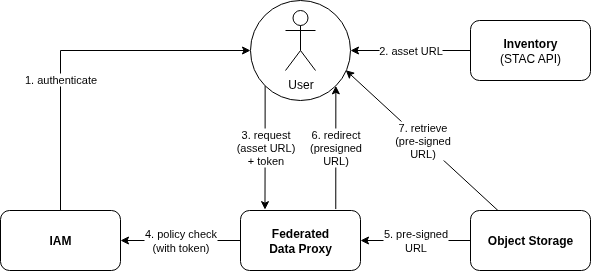

# Federated Data Proxy Architecture

## Overview

The Federated Data Proxy allows a platform to serve data from multiple (internal and external) providers, in such a way that is transparent to the service end-users.

The platform offers an Inventory (STAC Catalogue) to its users that enumerates all the available (online and offline) datasets, including those that are hosted in external data providers.

The platform data offering thus comprises:

* Locally managed data that is available online
* Locally managed data that has been long-term archived, and so is available offline
* External data that is routinely harvested and re-hosted 
  _Either whole datasets, or selected data according to a criteria_ 
  _E.g. rolling last N months data over a geographic region_
* Data that is retrieved on-demand - including:
    * data in the long-term archive
    * data that is not routinely harvested and re-hosted
    * data that is ordered for subsequent asynchronous access
* Online cache for data that has been requested on-demand

The Federated Data Proxy offers a single point of access that transparently supports retrieval covering all of these data management approaches.

## Approach

The Federated Data Proxy provides an 'access middleware' endpoint that transparently interfaces with each upstream data provider - including both internal and external data sources.

{: .centered}

The Inventory maintains asset `href` that resolve to the Federated Data Proxy endpoint - rather than to the upstream data provider. 

The user searches the Inventory via its STAC API to discover data of interest, and then follows the provided assest urls to request data retrieval. These requests go via the Federated Data Proxy which integrates with the data provider to satisfy the request.

The URLs served by the Federated Data Proxy correspond to the datasets and assets that are available in the upstream data providers. The URLs are designed to be transparent regarding the need or otherwise to retrieve the product from the upstream - including the following possible retrieval responses:

* Redirect to the asset directly in the upstream provider
* Synchronous delivery of the requested data from the online cache
* Synchronous delivery of the requested data - following retrieval from the upstream
* Asynchronous delivery of the requested data - following retrieval from the upstream

The URL encodes sufficient information for the Federated Data Proxy to marshall the retrieval appropriate upstream provider.

## Inventory (STAC Catalogue)

The use of the Federated Data Proxy as an 'access middleware' relies upon the Inventory being maintained with appropriate metadata, whose URLs direct retrieval requests to the Federated Data Proxy.

> It is anticipated that this responsibility is placed on the platform's harvesting subsystem - whose role is to interface with upstream data sources, to incrementally harvest metadata for available data, and populate the Inventory with appropriate metadata that includes 'proxied' asset URLs.

## Online Cache

The Federated Data Proxy maintains an online cache to minimise the overhead of retrieving data from the upstream provider. Requests are delivered from the cache. In the case of a cache miss, then the requested data will be retrieved by the Federated Data Proxy into the cache, from where it can be delivered to the caller.

> It is assumed that routine dataset harvesting is handled by a dedicated platform capability - i.e. outside of the scope of this BB.
>
> Harvested data can managed either by direct injection into the online cache (with appropriate policy - see below), or can be managed as a configured 'upstream' provider in the Federated Data Proxy

Cache retention policies should be configurable per dataset, including:

* Persisted permanently
* Rolling persistence for last N days
* Least recently accessed, according to a managed maximum storage consumption
* Others, to be considered

## Asynchronous Retrieval

Some data retrieval requests cannot be satisfied immediately - for example, if the data is not available in the online cache and must be retrieved from an upstream provider, or from a long-term archive, which could take a number of minutes. In such cases, the Federated Data Proxy needs an approach to handle these requests asynchronously, in such a way that is supported by typical clients and does not block the user experience.

In particular, the approach should be compatible with clients that are commonly used in the geospatial domain, such as GDAL. The Federated Data Proxy should be able to handle asynchronous requests in a way that is compatible with the client libraries and tools that users are likely to employ.

### Approach 1

The simplest approach would take this flow:

* The Federated Data Proxy accepts the request and immediately returns a `202 Accepted` response indicating that the request has been accepted and is being processed
* The response includes a `Retry-After` header indicating how long the client should wait before retrying the request
* The client can then retry the request after the specified time, at which point the Federated Data Proxy will either return the requested data if it is available, or continue to return a `202 Accepted` response if the data is still being processed
* The client can continue to retry until the data is available, or a maximum number of retries is reached, or another final status is returned

This approach keeps things simple, in that it uses the original request URL for subsequent retries, and does not require the client to manage a separate status endpoint - which may be easier for clients to handle. It does, however, make it harder for the server to distinguish between the initial request and subsequent retries. The server may have to implement logic for idempotency or request fingerprinting to ensure that it does not process the same request multiple times.

### Approach 2

A more robust approach would involve the use of a status endpoint:

* The Federated Data Proxy accepts the request and immediately returns a `202 Accepted` response indicating that the request has been accepted and is being processed
* The response includes a `Location` header pointing to a status endpoint where the client can check the status of the request
* The Federated Data Proxy can also include a `Retry-After` header in the response to indicate how long the client should wait before checking the status again
* The client can poll this status endpoint to check if the data is ready
* Once the data is available, the status endpoint will indicate that the data is ready, and the client can then retrieve the data from a provided URL

Whilst this approach is more complex, it provides a clearer separation between the request and the status of the request. It allows the server to manage the state of the request more effectively, and provides a clear mechanism for the client to check the status of the request without having to retry the original request.

However, it does require the client to implement logic to handle the status endpoint, which would most likely not be supported by typical geospatial clients and libraries.

## QoS Brokering [possible requirement]

A possible challenge for the Federated Data Proxy would be a high volume of data reriebal requests - in particular for data that is not deliverable from the cache.

In response, the Federated Data Proxy could broker each request through a Quality-of-service (QoS) enforcement of usage limits. Such limits could be applicable per user and/or group - and may include:

* Rate limits - number of requests per time period
* Rate limits (non-cached) - number of 'cache miss' requests per time period
* Bandwidth limits - data volume per time period
* Bandwidth limits (non-cached) - data volume requiring upstream retrieval per time period

## IAM Integration

The Federated Data Proxy should integrate with the platform's Identity and Access Management (IAM) system to ensure that data access is controlled according to the user's permissions.

In addition to controlling access, the Federated Data Proxy can faciliate the user to access protected data resources within the scope of their permissions.

### Object Storage Access

In the case that assets are delivered from protected object storage, the Federated Data Proxy can generate pre-signed URLs that allow the user to access the data directly, without the user needing to manage object storage credentials or tokens. This is particularly useful for large datasets where direct access is preferred.

{: .centered}

The user's retrieval request to the Federated Data Proxy will be authenticated and authorised against the platform's IAM system. If the user has the necessary permissions, the Federated Data Proxy will generate a pre-signed URL for the requested asset, which can then be used to access the data directly from the object storage.

This approach ensures that data access is secure and controlled, while also providing a seamless user experience.

## Possible Usage of Data Access Gateway BB

The Federated Data Proxy may be able to use the _Data Access Gateway_ building-block to support its implementation, including:

* Use of EODAG python library to interface with each data provider
* Evolution of the EODAG server to meet the 'access middleware' requirements
