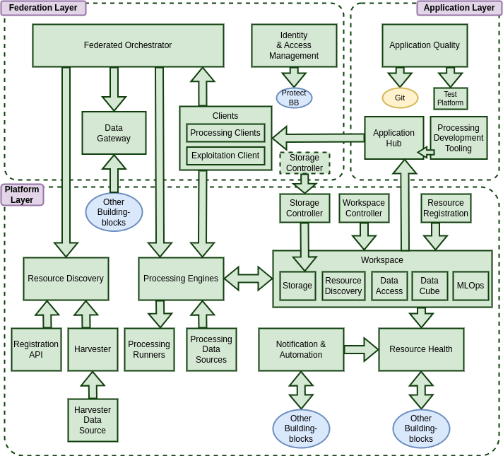

# High-level Architecture

## Overview

This section presents a high-level overview of the reference architecture that introduces the building-blocks in the context of an overall system. For a complete understanding the dedicated building-block sections should be consulted for more detail.

The Reference Architecture is defined as a set of building-blocks, each of which contributes to the overall capabilities of an integrated platform.

On their own the capabilities of the building blocks cannot be exploited without provision of data within their services. We recognise the challenge of data integration within a heterogenous platform deployment. Moreover, the successful execution of user-defined processing (algorithms/models) within a platform depends upon appropriately curated input data, that is presented in a form that meets the expectations of the processing workflow. The ideal solution is for a generic data curation approach in which the needs of processing workflows can be satisfied across multiple platforms, without the need for each platform to engineer their own data integration solution.

In response, the reference architecture design identifies the need for building blocks to be extensible – by providing ‘hooks’ through which dedicated capabilities can be integrated to satisfy specific data integration needs. This data-centric approach impacts a number of building blocks for which components are identified to establish reusable data integration capabilities. In particular, harvesting and data registration capabilities to establish the platform data offering, and processing capabilities to provide a consistent data offering upon which processing workflow developers can rely.

The architecture presents the building-blocks within a set of layers that attempt to reflect their notional role with a multi-platform distributed ecosystem. This layering should be regarded as illustrative as, in practice, the building-blocks and the architecture are flexible for adaption to many deployment scenarios.

The **Platform Layer** comprises capabilities for discovery of data and other resources, execution of processing workflows, and management/exploitation of added-value assets.

The **Federation Layer** comprises capabilities that operate across a set of distributed platforms, and attempt to consolidate their combined offerings towards a more homogenous consumable experience.

The **Application Layer** provides capabilities for development and publishing of applications for exploitation of platform services, and for showcasing research outcomes through information dashboards and web-enabled applications - applicable for both Platform and Federation use cases.

## Platform Layer

Platforms provide access to data and capabilities for executing processing workflows to derive new added-value data, and to extract actionable information that can be exploited through interactive dashboards and applications. The platform caters for many different types of resource (i.e. not just data), all of which are enumerated and discoverable through the **Resource Discovery**.

Platform-hosted **Processing Engines** provide compute close-to-the-data that supports a variety of paradigms for expressing processing workflows, including openEO Process Graphs [RD20] and OGC Application Packages. The Processing Engine provides the interface (API) that satisfies the expectations of the **Processing Clients**, whilst **Processing Runners** provide the runtime environment within which the execution of the processing workflow is performed. **Processing Data Sources** provide a mechanism to integrate data sources into the processing capability to provide a consistent input data offering.

Users need to maintain a variety of resources within the platform – including data for processing, processing workflow packages ready for execution, and results output from workflow executions, amongst other resources. The **Workspace** provides storage in which to persist user assets, and services (catalogue, data(cube) access and visualisation) through which those assets can be further exploited. The **Workspace Controller** allows to establish workspaces for users, and as shared spaces for groups/projects.

The **Storage Controller** allows the user to create and manage object storage buckets, and associate them with their Workspace and their processing workflows – including external (cross-platform) storage offerings – e.g. for long-term data preservation. **Resource Registration** provides a service through which assets can be registered into the Workspace services, so they can be discovered and further exploited.

Asynchronous and de-coupled communications between building-blocks is facilitated by the **Notification & Automation BB**, which also supports user-led automation through triggers that are linked to building-block ‘events’. Additionally, users can associate git repositories through which event triggers can be raised according to linked repository events (such as commits), and for users to configure their platform experience/content using a declarative GitOps approach.

The **Resource Health BB** provides a background service for monitoring and reporting health – of both platform services, and of published user content. To this end, platform operators/users are able to configure ‘checks’ to be performed on their resources of responsibility – with outcomes being summarised through a web-enabled dashboard.

## Federation Layer

In order to fully exploit the capabilities of multiple platforms and their complementary offerings, we introduce services that facilitate cross-platform consumption of resources.

The **Federated Orchestrator** provides an interface for execution of processing workflows that is designed to work cross-platform and cross-technology. The goal is for processing workflow execution to be directed (whole or in part) towards the most appropriate platform for remote execution – according to configured business rules.

**Resource Discovery** contributes to cross-platform integration with capabilities for catalogue federation, which allows search queries to federate across the offering of multiple platforms. This supports the Federated Orchestrator in the execution of cross-platform processing workflows.

Federation at the storage layer is facilitated by the **Storage Controller** that, in addition to managing storage within the platform, allows external storage services to be associated for Workspace storage.

The **Identity & Access Management BB** provides authenticated user identity and authorisation of access to resources provided by building-blocks. The approach is designed to be integrated as required with prevailing IAM solutions/architectures within an existing platform. Importantly for federation, the IAM BB integrates with commonly used identity services.

## Application Layer

The **Application Hub** provides hosted, user-extensible, interactive web-enabled tooling and applications. This includes the ability for users to publish web dashboards and web-enabled applications through which their value-adding outcomes can be consumed – e.g. delivery of actionable information to decision makers through interactive scientific storytelling. It provides a framework through which any web-applications can be contributed/published – such as development tooling for processing workflow developers.

The **Application Quality BB** provides tooling that supports and encourages the development of Processing Workflows in accordance with software engineering best practices – whilst providing an environment to test their workflow execution and optimise the code.
