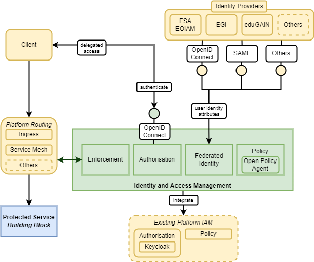

# Identity & Access Management Architecture

## Overview

The Identity and Access Management (IAM) BB provides user identity (authentication) and access management (request authorisation).

The Identity & Access Management BB design should follow a modular approach through components that implement specific capabilities:

* **Authorisation** 
  Authorisation of requests to platform hosted resources.
* **Federated Identity** 
  Authenticated user identity and attributes, through integration with external identity providers.
* **Policy** 
  Rules engine to support authorisation decisions.
* **Enforcement** 
  Protected access for requests to platform hosted resources.

{: .centered}

## Authorisation

The first step in accessing the platform is to authenticate the user and so establish their identity. Thus, the Identity and Access Management BB provides an OpenID Connect (OIDC) interface through which clients can authenticate users and obtain delegated access to their resources within the platform.

Requests to the platform services provided by the building-blocks must be authorised by the Identity and Access Management BB before being allowed to pass to the target BB service (Resource Server). The Authorisation components orchestrates this in conjunction with the Policy and Enforcement components.

## Federated Identity

A user wants to use their existing identity with each platform, rather than having to create a dedicated identity in each. Thus, the Identity and Access Management BB must support standard interfaces through which common external Identity Providers (IdP) can be integrated – including ESA EOIAM, EGI, eduGAIN, and other providers via OpenID Connect (OIDC).

The platform wants to uniquely identify each user and authorise access to the platform resources using policy rules that rely upon the user identity and associated attributes.

Attributes are linked to a user's identity and will be maintained at multiple levels:

* **External identity provider** 
  General attributes such as their name, email, affiliation, etc.
* **Local platform** 
  Attributes that have been defined within the context of the local platform, such as groups defined for resource sharing.

To avoid duplication and aid federation, the aim should be to maintain 'common' attributes (as many as possible) in the external identity provider - minimising the need for 'local' attributes in the platform.

## Policy

The Policy Engine maintains a set of policy rules that are applied to platform resources to establish whether a given request should be allowed or denied. The policy rules are expressed in terms of user identity/attributes and other platform considerations. The Policy Engine is consulted during the request authorisation flow, and thus should provide suitable interfaces for integration - including (at least) integration with Keycloak.

The Identity and Access Management BB may include its own 'internal' policy engine, but should also be extensible for integration with alternative policy engines. In particular, integration of a policy engine that supports policy/rules expressed using Open Policy Agent syntax.

## Enforcement

The Identity and Access Management BB provides an interface through which access requests can be authorised based upon the user identity/attributes in relation to the resource being requested.

It is important to ensure that the Building Blocks can be easily re-used in existing platforms – perhaps those with established Identity and Access Management approaches. For example, experience indicates that many platforms use Keycloak.

Requests to the platform services provided by the building-blocks must be authorised by the Identity and Access Management BB before being allowed to pass to the target BB service (Resource Server). There are a number of approaches through which this is commonly architected, including:

* **Ingress (reverse proxy)** 
  For example, integration with ingress-nginx within a Kubernetes cluster via ‘auth_request’ – e.g. using Gatekeeper as per the current EOEPCA integration with Keycloak
* **API Gateway / service mesh** 
  For example, via Istio.

These represent typical approaches in existing operational platforms, and hence the Identity and Access Management approach should ensure that the Building Blocks can be integrated into such architectures. Thus, the Identity and Access Management should include capabilities to facilitate request authorisation integration:

* **Auth Proxy** 
  Integration between ingress/reverse-proxy and Identity and Access Management BB – at minimum integration with Nginx and Keycloak
* **Auth Mesh** 
  Integration between API Gateway / Service Mesh and Identity and Access Management BB – at minimum integration with Istio and Keycloak.

## IAM Best Practice

In addition, the Identity and Access Management design should take into account the approaches advocated by the following existing initiatives:

* [GAIA-X](https://gaia-x.eu/){:target="_blank"}
* [Simpl](https://digital-strategy.ec.europa.eu/en/news/simpl-streamlining-cloud-edge-federations-major-eu-data-spaces-updated-october-2023){:target="_blank"}
