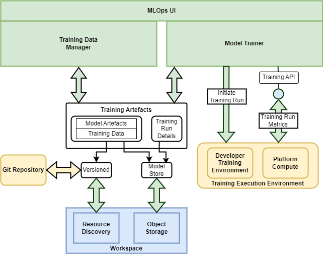

# MLOps Architecture

## Overview

The MLOps BB provides support services for training of machine learning models within the cloud platform. To this end the following capabilities must be provided:

* Initiate training runs, with support for the most popular machine learning frameworks
* Provide for each training run the resultant metrics to assess model performance
* Maintain a history of training runs including the associated parameterisation and model metrics
* Manage training data – with support for versioning and registration as discoverable resources
* Establish model versions – maintaining the model assets in S3 object storage
* Register versioned models for Resource Discovery via Resource Registration

{: .centered}

## Components

The MLOps BB design should follow a modular approach through components that implement specific capabilities.

### Model Trainer

**_Initiation and management of training runs and model artefacts._**

The Model Trainer should support all popular ML frameworks – such as tensorflow, pytorch, etc. – and with an appropriate model artefact representation, such as ONNX. It supports initiation of model training runs with specific parameterisation and training data - and provides an API through metrics regarding each model run are recorded – used to maintain a history of all details pertaining to training runs.

The Model Trainer integrates with the Workspace BB for storage and publishing of model artefacts. For discovery, the model should be expressed as a STAC item – for example using the ‘ml-model’ extension (https://github.com/stac-extensions/ml-model).

### Training Data Manager

**_Management of training data._**

The Trainer Data Manager integrates with the Workspace BB for publishing, (and possibly also storage), of ML training data. For discovery, the training data should be expressed as STAC items [[RD22]][rd22] – informed by the work of the Earth Observation Training Data Lab [[RD31]][rd31].

### MLOps UI

**_Web-enabled UI for interactive management of models, training runs and training data._**

The MLOps UI provides a web-enabled UI through which the model training can be orchestrated, including initiation of training runs and the history of training run outcomes.

## Workspace Integration

The MLOps BB should be designed for integration as a service provided within a user/project Workspace – and so create a ‘space’ within which projects can collaborate on model development.
