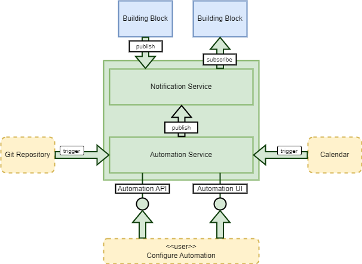

# Notification & Automation Building Block

## Overview

The Notification & Automation BB provides a service for intra-Building-Block asynchronous communications with support for triggers linked to automated behaviour. This capability is designed to establish loose coupling between building-blocks and satisfy the need for data-driven and scheduled behaviour.

The Notification & Automation building-block offers a framework that comprises the following components:

* **Notification Service** 
  Provides asynchronous event-based messaging for intra-building-block communications.
* **Automation Service** 
  Supports user-definable automation that can be triggered for data-driven and scheduled behaviour.

{: .centered}

## Notification Service

The building-blocks provide APIs (typically REST) through which their services are accessed. These APIs, which are based on open standards where possible, are specifically exposed as the public-facing API to the building-block. These interfaces are essential for public access and for interoperability amongst platforms.

The Notification Service provides a complementary interface to the building-block, to be exploited for ‘internal’ communications amongst building-blocks. It allows building-blocks to collaborate with loose coupling. Cases suited to internal messaging include:

* Broadcast of information that may be applicable to multiple building-blocks, including triggering of automated behaviour
* Asynchronous requests (tasks) from one building-block to another

For example, specific cases of asynchronous intra-BB communications include:

* Processing Engine notification of processing workflow outputs and reproducible job details, to trigger registration into Workspace services
* Harvester notification of new/updated records, to trigger registration into Resource Discovery, Data Access services, etc.
* BB reporting of resource usage information, to be consumed by an accounting BB

There remain many other cases where building-blocks will rely upon each other’s (REST) APIs - for example, synchronous retrieval (lookup) of information, etc.

The Notification Service shall use a standard event-based approach - taking consideration of existing relevant approaches:

* cloudevents [[RD29]][rd29]
* OGC Publish/Subscribe [[RD30]][rd30]

**_Examples of existing Messaging System solutions include Apache Pulsar, RabbitMQ, Kafka, etc._**

### Design Justification

Use of a messaging system for asynchronous communications between building-blocks allows greater extensibility and replaceability of components. It makes development of building-blocks more independent so that multiple teams can contribute to different areas simultaneously.

* **Reduced building-block coupling** 
  Services pass control and/or data with events submitted to the Notification Service, without needing to know the consumer of the event. 
  Moreover, the handling of an event on the Notification Service is asynchronous to its submission – thus freeing the event publisher to ‘fire-and-forget’ with no need to wait for a reply. This leads to a model of tasks (events) and workers (services).
* **Resilient messaging** 
  Avoids message loss with asynchronous event handling, which is supported by queues that are backed by persistence. This provides resilience, which tolerates message bursts without risking overloading buffers that may otherwise exist between component point-to-point connections.
* **Broadcast** 
  The Publish/Subscribe pattern allows to broadcast information to multiple recipients. Importantly the building-block publishing the information (event) does not need to know which/how-many other building-blocks are interested in the event. This helps to reduce coupling such that additional consumers can be added without modification of the event source building-block.
* **Scalability** 
  The Workers pattern facilitates the deployment of multiple replicas of a given ‘stateless’ building-block, each of which acts as a ‘worker’ for the service. Each worker subscribes to the same event types (i.e. those relevant to the building-block) – the events being consumed at runtime by whichever worker is next available.

From a platform perspective, an additional benefit of this communications approach is that it facilitates modularity and extensibility of the system:

* **Modularity** 
  The decoupling of message consumers from producers encourages the development of self-contained workers (consumers) that have a focused role.
* **Extensibility** 
  The modular design and the associated de-coupling facilitates the addition of new functions as workers – without the need to inform/configure the message producers.

## Automation Service

The Automation Service supports triggers provided by various sources including the Notification Service (i.e. events raised by other building-blocks), Git repository webhooks and scheduled calendar events.

This underpins platform level automation, such as:

* Resource Discovery notification of new/updated records to trigger bulk processing
* Calendar event (daily, weekly, etc) to trigger systematic processing
* Addition/update of dataset details – specified declaratively in a Git repository – to trigger registration in Resource Discovery and/or harvesting.

**_Examples of existing Automation Service solutions include Argo Events, etc._**

### Declarative Provisioning

The Automation Service should support triggers linked to Git repository webhooks. This allows a Gitops-style approach to the administration of various content within the platform – in which content can be maintained in ‘watched’ Git repositories, such that updates (commits) to this version controlled content can trigger updates with the platform service content. This approach is applicable at both system-level (platform) and user/group/project-level. Content managed in this way can include: dataset definitions, controlled vocabularies, published workflows, etc. This allows the use of Gitops processes, such as pull requests, and staging vs live branches to manage platform configuration and content. Similarly, ‘users’ can maintain their own private resources (metadata/workflows/etc.) in their Workspace by linking their Git repos/organisations.

**_It is noted that the current Open Science Catalogue adopts a similar GitHub-based approach to the management of its dataset holding._**
