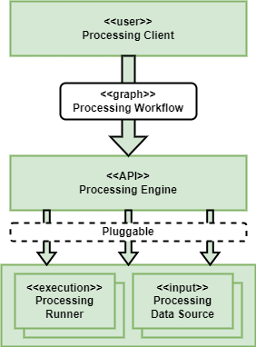
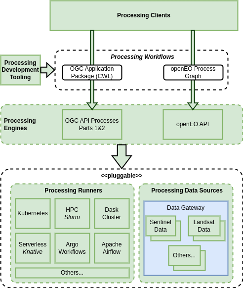

# Processing Architecture

**See also the [Detailed Processing Design](/projects/processing)**

## Overview

The Processing BB supports user analysis and processing workflows across various popular technology stacks, and across an ecosystem of federated platforms. The Processing BB is defined by a set of extensible components that allow the Processing BB implementation to be adapted for multiple processing APIs and execution engines - as illustrated in the following figure.

{: .centered}

The Processing Workflow describes the steps that together combine to achieve a collective goal – typically expressed as a graph of steps. There are a number of approaches that are currently popular through which users express their processing workflows:

*	OGC Application Package (Common Workflow Language (CWL) [[RD25]][rd25] document) [[RD18]][rd18]
*	openEO Process Graph [[RD20]][rd20]
*	Others, for future consideration – such as Dask Task Graph

In each of these cases the workflow is constructed in a suitable client and submitted, as a workflow, for execution – typically submitted to a server-side (platform) backend for execution close to the data - as illustrated by the OAPIP (OGC API Prcesses) and openEO Processing Engine components identified in the following figure...

{: .centered}

For some Processing Engine implementations, it may be desirable to provide an implementation of the Xarray backend through which their services can be consumed as Xarray datasets. Perhaps this forms part of the implementation of the respective processing clients.

## Processing Client

The Processing Client refers to the user tooling that supports the expression of the Processing Workflow, and interactions with the Processing Engine for workflow execution. Typically this is provided by a library with bindings to common programming languages, such as Python.

Thus, the Processing Client abstracts the underlying details of the Processing Workflow and the API interface of the associated Processing Engine, towards a programming language closer to the user – including Python, R, JavaScript, Julia.

## Processing Engine

The Processing Engine provides a backend service with a public standard API through which Processing Clients submit Processing Workflows for execution. The clients rely upon specific service APIs that correspond to the type of workflow:

| Processing Engine Interface | Processing Workflow Description Format |
|---|---|
| OGC API Processes Parts 1&2 [RD05/RD06] | OGC Application Packages |
| openEO API [[RD19]][rd19] | openEO Process Graph [[RD20]][rd20] |

The Processing Engine is responsible for implementing the API in accordance with the defining standard/specification. Each Processing Engine should be engineered to be extensible with pluggable Processing Runners.

### OAPIP Processing Engine

The OAPIP Processing Engine provides an implementation of the OGC API Processes standard – Parts 1 & 2(draft) [RD05/RD06] in conjunction with the OGC Best Practice for Application Packages [[RD18]][rd18].

The building-block should support extensible Processing Runner implementations – noting that the current EOEPCA ADES component (ZOO-Project-DRU) provides a CWL runner (Calrissian) that executes on Kubernetes. Work has also been performed to integrate an alternative CWL Runner (TOIL) that executes on Slurm HPC.

The OAPIP building-block should support the integration of steps within the Application Package CWL [[RD18]][rd18] that exploit other processing backend technologies, including:

*	Steps that execute openEO Process Graphs [[RD20]][rd20]
*	Steps that execute Dask Task Graphs

The programmatic Processing Client should facilitate interaction with the OGC API Processes Processing Engine, including dynamically establishing (i.e. in code) the OGC Application Package CWL [[RD18]][rd18] workflow steps for execution.

### openEO Processing Engine

The openEO Processing Engine provides an implementation of the openEO API Specification [[RD19]][rd19], to support the remote execution of openEO Process Graphs [[RD20]][rd20].

There is an opportunity to engineer the openEO building block in such a way that it also facilitates consumption through users of the Pangeo stack. Several measures are identified that may aid this interoperation:

*	Processing Runner that is based on Dask
*	Processing Client providing an implementation of the Xarray backend through which the openEO service be consumed as Xarray datasets
*	Use of Zarr for data representation

Processing Client tooling already exists within the openEO stack, with support for Python, JavaScript and R.

## Processing Runner

The Processing Runner represents the environment that actually executes the workflow – establishing separation between the public-facing API (provided by the Processing Engine), and the backend capability that hosts the execution.

We can identify a set of Processing Runners that are in common usage in existing platforms:

*	Docker (e.g. via docker-compose – useful for local testing)
*	Kubernetes
*	Dask Cluster
*	HPC via Slurm
*	Argo Workflows
*	Apache Airflow
*	Serverless – e.g. Knative

We want Processing Engine implementations to be extensible such that alternative Processing Runners can be plugged-in. This facilitates the integration of the Processing building-blocks with existing/preferred technologies adopted by platform providers.

## Processing Data Source

The Processing Data Source provides an integration with a data source to make the dataset available as a processing workflow input. Designed to be plugged-in to the Processing Engine/Runner for a given deployment.

There is a dependency between the processing workflow and the data upon which it is designed to operate. This component facilitates the ability of the Processing Engine/Runner to deliver the input data to the processing workflow in the expected form.

### Data Gateway Reuse

See section [Processing Data Source dependency on the Data Gateway][processing-data-sources-usage].

The implementation of the Processing Data Source components may be partly or wholly met by the capabilities of the [**Data Gateway**][data-gateway-architecture] building block, that is designed to provide a reusable/extensible implementation that encapsulates the interface with the data providers.

The Data Gateway can provide a consistent means for identifying both data provider and datasets for processing inputs – such that a given processing workflow can be ‘verified’ against specified dataset/provider combinations.

The Data Gateway can facilitate the Processing Data Source to obtain a STAC representation of the input data, with local or remote asset links - thus supporting stage-in in accordance with the [OGC Best Practice for Application Packages (EO Products Data Flow Management)](https://docs.ogc.org/bp/20-089r1.html#_eo_products_data_flow_management).
