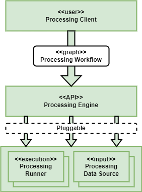

# Processing Concepts

The platform must support the user’s analysis and processing workflows across various popular technology stacks, and across an ecosystem of federated platforms.

To establish common terminology within this document, we define an overall concept for workflow processing – as illustrated by the following figure.

## Processing Client

The Processing Client refers to the user tooling that supports the expression of the Processing Workflow, and interactions with the Processing Engine for workflow execution. Typically this is provided by a library with bindings to common programming languages, such as Python.

Thus, the Processing Client abstracts the underlying details of the Processing Workflow and the API interface of the associated Processing Engine, towards a programming language closer to the user – including Python, R, JavaScript, Julia.

## Processing Workflow

The Processing Workflow describes the steps that together combine to achieve a collective goal – typically expressed as a graph of steps. There are a number of approaches that are currently popular through which users express their processing workflows:

*	OGC Application Package (Common Workflow Language (CWL) [[RD25]][rd25] document) [[RD18]][rd18]
*	openEO Process Graph [[RD20]][rd20]
*	Others, for future consideration – such as Dask Task Graph

In each of these cases the workflow is constructed in a suitable client and submitted, as a workflow, for execution – typically submitted to a server-side (platform) backend for execution close to the data.

## Processing Engine

The Processing Engine provides a backend service with a public standard API through which Processing Clients submit Processing Workflows for execution. The clients rely upon specific service APIs that correspond to the type of workflow:

| Processing Engine Interface | Processing Workflow Description Format |
|---|---|
| OGC API Processes Parts 1&2 [RD05/RD06] | OGC Application Packages |
| openEO API [[RD19]][rd19] | openEO Process Graph [[RD20]][rd20] |

The Processing Engine is responsible for implementing the API in accordance with the defining standard/specification. Each Processing Engine should be engineered to be extensible with pluggable Processing Runners.

## Processing Runner

The Processing Runner represents the environment that actually executes the workflow – establishing separation between the public-facing API (provided by the Processing Engine), and the backend capability that hosts the execution.

We can identify a set of Processing Runners that are in common usage in existing platforms:

*	Docker (e.g. via docker-compose – useful for local testing)
*	Kubernetes
*	Dask Cluster
*	HPC via Slurm
*	Argo Workflows
*	Apache Airflow
*	Serverless – e.g. Knative

We want Processing Engine implementations to be extensible such that alternative Processing Runners can be plugged-in. This facilitates the integration of the Processing building-blocks with existing/preferred technologies adopted by platform providers.

## Processing Data Source

The Processing Data Source provides an integration with a data source to make the dataset available as a processing workflow input. Designed to be plugged-in to the Processing Engine/Runner for a given deployment.

There is a dependency between the processing workflow and the data upon which it is designed to operate. This component facilitates the ability of the Processing Engine/Runner to deliver the input data to the processing workflow in the expected form.

## Processing Building-block Approach

In accordance with the Processing Concepts, we identify here a set of building-blocks that reflect the different technology stacks…

We define a Processing Building-block for each identified Processing Workflow paradigm – each of which encompasses all elements of the stack **(Note 1)**:

*	Processing Engine
*	Processing Runner(s) – one or more
*	Processing Data Source(s) - numerous
*	Processing Client **(Note 2)**
*	Processing Development Tooling **(Note 3)**

!!! Notes
    1. Opportunities for common design and implementation across these Processing BB variants should be sought, and so promote them as complementary approaches that can be used together in workflows that are not constrained within the offering of one or other technology variant.
    2. It may also make sense for processing building-blocks to provide an implementation of the Xarray backend through which their services can be consumed as Xarray datasets. Perhaps this forms part of the implementation of their respective processing clients.
    3. The Processing Development Tooling refers to web applications that provide tooling that supports the development of the Processing Workflow – designed for integration with the Application Hub. In particular…
        1. visual editing of the workflow graph and specification of node attributes
        2. packaging of Application Package [[RD18]][rd18] code into container images
        3. others TBD
