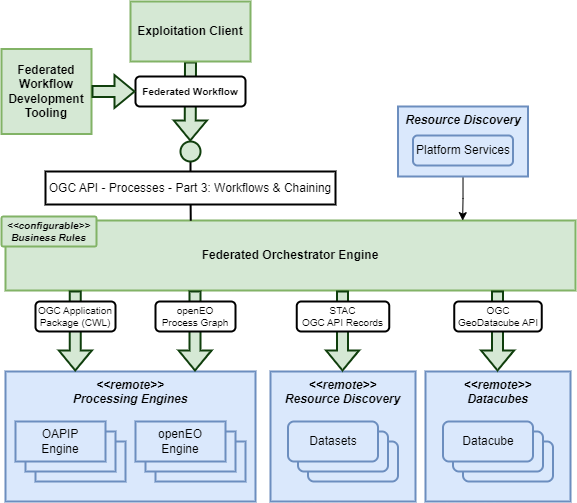

# Federated Orchestrator Building Block

## Overview

The Federated Orchestrator is designed to operate in an environment where cloud platforms expose their processing/analysis offering through a variety of Processing Engine technologies. The Federated Orchestrator provides a **Workflow API** through which any of the defined Processing Workflow types can be submitted for execution, and provides a homogenous interface through which workflows can be executed that exploit the services of multiple platforms using different processing engine technologies.

It is expected that the OGC API Processes Part 3: Workflows and Chaining (draft) [[RD07]][rd07] will form the basis of the Workflow API. OGC API Processes Part 3 (draft) [[RD07]][rd07] is defining an API interface for workflow execution – for which we anticipate the inclusion of profiles that reflect the Processing Workflow types identified in this architecture – i.e. openEO Process Graph [[RD20]][rd07], OGC Application Package CWL [[RD18]][rd18], etc. The expectation is that this converges towards a homogenous Workflow API that supports the needs of each processing technology stack. This architecture and the use cases that drive it should be part of the discussion that informs the evolution of this candidate standard.

In a similar way as for the Processing building-blocks, the Federated Orchestrator building-block should comprise not only the backend service capability, but also the tooling that facilitates its use. Thus, the Federated Orchestrator building-block comprises:

*	**Federated Orchestrator Engine**
  Provides the Workflow API through which federated workflows are submitted for cross-platform execution.
*	**Exploitation Client**
  Programmatic client that abstracts the API interfaces offered by the platform, towards a programming language closer to the user.
*	**Federated Workflow Development Tooling**
  Web applications that provide tooling that supports the development of Federated Workflows, e.g. visual workflow editing – designed for integration with the Application Hub.

## Federated Orchestrator Engine

The Federated Orchestrator Engine implements the Workflow API to provide **Cross-platform Orchestration** of workflows. In the simplest case, the Federated Orchestrator Engine can act as a ‘broker’ in which submitted workflows are forwarded to an appropriate remote Processing Engine for execution. The Federated Orchestrator Engine can apply an additional level of sophistication, in which the workflow steps are selectively submitted (as sub-workflows) to appropriate remote Processing Engines for execution – the overall workflow being coordinated by the Federated Orchestrator Engine.

In doing so the Federated Orchestrator Engine should not limit workflow orchestration within a single Processing Workflow paradigm. Instead we should consider hybrid workflows in which individual steps may target differing Processing Workflow paradigms. The goal here is to remove barriers between the different technologies such that workflows can comprise steps across all identified Processing Workflow technologies. It is anticipated that this would involve dynamic translation between the workflow languages of the different paradigms – in order to submit appropriate (sub-)workflows to Processing Engines.

## Exploitation Client

The Exploitation Client is used to abstract the API interfaces offered by the platform, towards a programming language closer to the user.

Variants of the Exploitation Client are anticipated for various languages, and can be seen as independent implementations – Python, R, JavaScript, Julia.

The Exploitation API is defined by the collection of standard services that are exposed by the building-blocks defined in the architecture. Uptake of the architecture and its building-blocks would be facilitated by an Exploitation Client – a programmatic representation of the Exploitation API which acts as an abstraction of the Common Architecture Platform. Such a client facilitates the development of portable client implementations and encourages interoperability amongst platforms (common client).

The Exploitation Client should build upon the Processing Client implementations defined by the Processing building-blocks to facilitate the user to create programmatic workflows that interface with the platform services. Thus, it should provide programmatic semantics that cover at least:

*	Connection to platforms that offer Processing Engines, Federated Orchestrator, Resource Discovery and Access
*	Discovery of data, to be identified as input to processing operations
*	Execution and chaining of processing workflows
*	Retrieval and visualisation of data and processing outcomes

openEO already provides a client library (implemented in Python, R and JavaScript), and some OGC services are supported via libraries such as OWSLib. The Exploitation Client is seen as an extension to these to cover the full set of platform services required to implement heterogenous cross-platform workflows.

