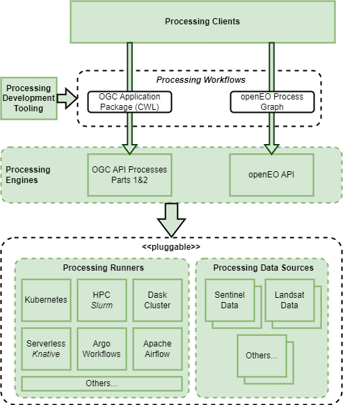

# Processing Building Blocks

In accordance with the Processing Concepts, we identify here a set of building-blocks that reflect the different technology stacks…

We define a Processing Building-block for each identified Processing Workflow paradigm – each of which encompasses all elements of the stack **(Note 1)**:

*	Processing Engine
*	Processing Runner(s) – one or more
*	Processing Data Source(s) - numerous
*	Processing Client **(Note 2)**
*	Processing Development Tooling **(Note 3)**

!!! Notes
    1. Opportunities for common design and implementation across these Processing BB variants should be sought, and so promote them as complementary approaches that can be used together in workflows that are not constrained within the offering of one or other technology variant.
    2. It may also make sense for processing building-blocks to provide an implementation of the Xarray backend through which their services can be consumed as Xarray datasets. Perhaps this forms part of the implementation of their respective processing clients.
    3. The Processing Development Tooling refers to web applications that provide tooling that supports the development of the Processing Workflow – designed for integration with the Application Hub. In particular…
        1. visual editing of the workflow graph and specification of node attributes
        2. packaging of Application Package [RD18] code into container images
        3. others TBD
