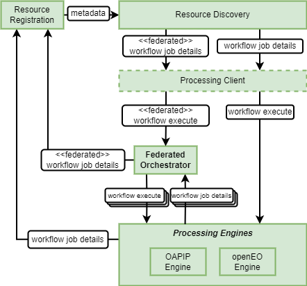

# Reproducible Science

To support reproducible open science, the architecture must support the capability to record the details of process and workflow execution, in order to reproduce the conditions of the original. This impacts the following building-blocks:

*	Resource Discovery
  Maintain records of workflow job execution details.
*	Processing Engines
  Report details of (sub-)workflow job executions – possibly to be consolidated by the Federated Orchestrator.
*	Federated Orchestrator
  Report details of orchestrated workflow job executions – by consolidation of sub-workflow jobs in Processing Engines.

To achieve reproducibility the job details must be recorded regarding workflow execution at all levels. Thus, the Processing Engines must output jobs details that can be recorded as resources in the Resource Discovery. The Federated Orchestrator must similarly output aggregated job details pertaining to the overall workflow execution, comprising the details of individual steps executed in the Processing Engines.

The Job Details recorded should record all information required to reproduce the job, including at least:

*	references to input data
*	all input parameterisation
*	versions of software components (e.g. application version)
*	platform (processing engine/runner) version

The information recorded will support a variety of reproducibility scenarios, including:

*	**Rerun**
  Rerun the exact same Research under original conditions to achieve the same outcome - meaning that it is invoked on the same platform with the same input data and parameterisation.
*	**Repeat**
  'Rerun' the Research, but on another platform. In all other respects the execution should be the same and should achieve the same result. 
  This implies that the ’process’ execution packages must be portable across platforms.
*	**Replicate**
  Run the same Research, with the same parameterisation, but with different input data (e.g. different spatial or temporal extent) - with the expectation to achieve equivalent results.
*	**Reproduce**
  Run an independent implementation of the same Research algorithms, with the same inputs and parameterisation - with the expectation to achieve equivalent results, and so corroborate the original findings.
*	**Reuse**
  Repurpose the same application into a different context - perhaps reinterpreting the published outcomes to infer some conclusions applicable to a different domain.

The reproducibility is further facilitated by the ability to link supplementary resources to the job artefacts:

*	Processing Workflow packages
*	Dataset and Datacube metadata
*	Source Repository for Processing Workflow packages
*	Documentation for Processing Workflow packages
