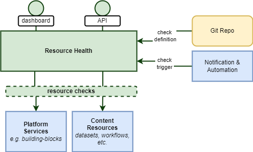

# Resource Health Architecture

The Resource Health BB aims at supporting the platform operators and users to monitor the health of the platform resources for which they are responsible – i.e. Operators to monitor platform resources, and Users to monitor their own published resources.

To this end, the Resource Health BB should offer a generalised capability that allows all types of users (operators, administrators, users, etc.) to specify and schedule checks relating to their resources of interest, to visualise the outcome of the checks, and to receive notifications according to the outcome.

{: .centered}

The Resource Health BB generalised capability should support specification of health checks that include (not limited to):

* A platform service, such as a building-block – the service is ‘up’ and responsive
* A published dataset – discovery, access and visualisation
* A published Processing Workflow – discovery, deployment and execution
* A published Workflow-as-a-Service (i.e. a pre-deployed processing workflow) – end-to-end execution
* Access to other published resources, such as documentation

Users of the Resource Health BB will be able to specify all aspects of the check to be performed – including the target (endpoint/resource) of the check, the tests to be performed and the expected outcomes.

The Resource Health BB will provide a dashboard through which to visualize the status of any health checks that the user has defined.

The Resource Health BB will provide an API through which the status of any health checks can be interrogated (machine-to-machine) – for example to integrate the status into a portal.

The Resource Health BB will provide a convenient means for users to configure checks to be performed. We advocate a GitOps approach in which linked Git repositories define checks to be performed declaratively – e.g. a file in a well known location in the repo. For example, the Git repository for a user’s Processing Workflow can also define the associated checks to be performed. The advantage of this is to keep the check definition alongside the artefact, and also raises the possibility to reuse the check if the service is deployed to subsequent platforms.

The Resource Health BB will support the triggering of each check according to a time schedule. For this, integration with the Notification & Automation BB should be considered. In addition, the Resource Health BB should also support checks whose outcome is linked to occurrence of ‘events’ reported in the log output of specified resources.

The Resource Health BB should maintain metrics for each check to be reported in its dashboard, such as:

* Number of checks performed vs number of failures
* Uptime – since last failure
* Others, TBD
