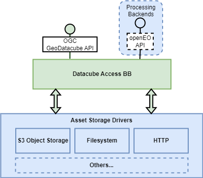

# Datacube Access Building Block

The Datacube Access BB provides ‘pixel-based’ access to multidimensional data in accordance with the emerging OGC GeoDatacube API [[RD28]][rd28]. The goal of this API is to harmonise access to multidimensional data – and in doing so facilitate fusion of data from multiple sources by allowing alignment of units, geometries, references systems, etc. During OGC Testbed-19 the approach attempted to consolidate the APIs offered by the openEO Specification [[RD19]][rd19] and OGC API Processes [[RD05]][rd05]/[[RD06]][rd06] to present a singular interface.

Via this interface, the Datacube Access BB offers a data access interface that is designed to satisfy the data access requirements of the openEO Building Block.

Data assets are provided through a variety of storage technologies. The Datacube Access BB should use a modular design through which an extensible set of storage interface capabilities can be added. For this the Asset Storage Drivers that are defined as components of the Data Access BB can be relied upon.
