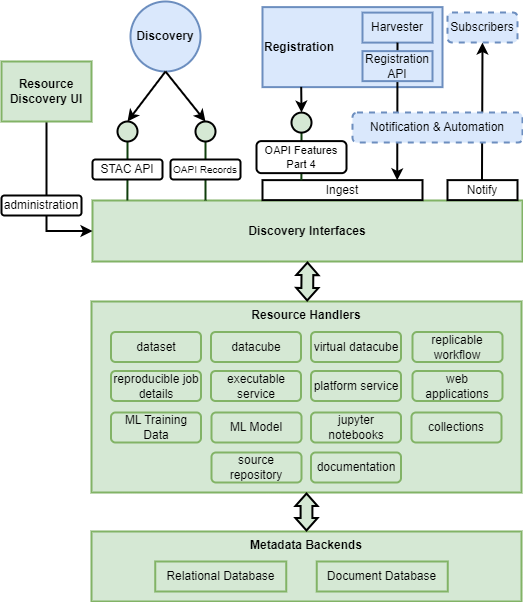

# Resource Discovery Building Block

## Overview

Resource Discovery provides a catalogue that maintains metadata for the resources held within a platform, and also supports platform federation by maintaining records to resources in other platforms.

## Components

The Resource Discovery design should follow a modular approach that is extensible through components that implement specific capabilities.

### Discovery Interfaces

**_Extensible set of APIs to support search and discovery._**

Resource Discovery should present search and browse interfaces. For interoperability these interfaces should be based on open standards:

*	Spatio Temporal Asset Catalog (STAC) [RD22]
*	OGC API Records [RD08]

### Metadata Backends

**_Extensible set of backends in which to persist and query the metadata._**

The Resource Discovery building block should establish separation between its service-layer, and its data storage layer – to facilitate the integration of alternative database technologies, such as PostGIS, ElasticSearch, etc. This allows the Resource Discovery building-block to be flexible for different platform requirements for scalability and resilience – and to facilitate integration in existing platform environments.

### Resource Handlers

**_Extensible set of resource types to be handled._**

The initial set of resource types is defined in section [Resource Types](resource-management-concepts.md#resource-types) – the handlers for which should be implemented within a an extensible approach through which future needs can be met.

###	Resource Discovery UI

Web-enabled UI providing administrative access to the capabilities of the Resource Discovery BB.

## Metadata Registration

Resource Discovery integrates with the Notification & Automation BB to receive metadata additions/updates and to raise notification events to interested subscribers – such as for data-driven systematic processing.

In addition, Resource Discovery provides an API interface for direct registration of resources – via OGC API Features Part 4 (Create, Replace, Update and Delete [Transactions]) [RD10].

## Best Practice

Resource Discovery shall maintain metadata in accordance with industry best practice, including:

*	CEOS Service Metadata and Discovery Best Practices [RD26]
*	[DRAFT] CEOS Jupyter Notebooks Best Practice [RD27]
