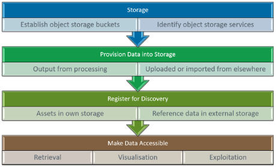

# Resource Management Concepts

## Overview

Resource Management defines building-blocks for storage, discovery, access and management of a variety of resource types within the platform – applicable at a number of possible levels within the platform: global (platform), project/group, user.

Here we introduce some resource management concepts that inform the design of the building-blocks.

## Resource Types

The types of resource maintained should be extensible, but should initially include:

*	**Datasets** 
  Comprising file assets accessed through http/s3 URLs.
*	**Datacube** 
  Multidimensional data accessed through cloud-optimised file formats, e.g. COG, Zarr, NetCDF.
*	**Virtual Datacube** 
  A virtual datacube is created on-demand by execution of a Processing Workflow with specific parameterisation, e.g. an openEO process graph. Thus, the catalogue resource metadata must identify the workflow and the associated parameterisation. 
  To be investigated whether this can be satisfied by the STAC datacube extension [RD23].
*	**Replicable Workflows** 
  Data processing algorithms packaged as processing bundles for execution in the Processing Engines and Federated Orchestrator. Designed to be user-contributed. Allows to establish a library of available replicable processing workflows.
*	**Reproducible Job Details** 
  Full details pertinent to the execution of a research ‘job’ (processing workflow execution) for the purpose of reproducible open science.
*	**Jupyter Notebooks** 
  In conformance with CEOS Best Practice [RD27], Notebooks published for sharing and/or linked to other resources.
*	**Executable Services** 
  Replicable workflows that are ready deployed and published for execution. Published endpoints through which specific replicable workflows can be invoked. For example, a pre-deployed OGC Application Package that is ready for execution.
*	**Platform Services** 
  Discoverable services published by platforms for exploitation within federated scenarios. Allows an inventory of services to be maintained for platform federation. Typical services include external resource (metadata) catalogues and processing engines.
*	**Web Applications** 
  Applications that run within the platform as web services and present a web UI – designed to be user contributed. For example, discoverable services such as Dashboards for scientific storytelling that showcase research outcomes, etc. 
*	**Machine Learning Training Data** 
  This is an extension of Datasets – ensuring that the specific needs of Machine Learning (ML) data can be met. See Earth Observation Training Data Lab [RD31] for possible approach.
*	**Machine Learning Models** 
  This represents the collection of files that encapsulate a ML model – including any configuration and scripts that support the execution and training pipelines - ensuring that ML models can be accommodated and executed within the platform. Standard model formats, such as ONNX, should be specifically supported – and platforms should be expected to expose models in this format.
*	**Collections** 
  Aggregated and curated datasets, to aid organisation and discovery and simplify data access.
*	**Source Repository** 
  References to software packages etc. relating to open reproducible science – e.g. reference to a source (Git) repository.
*	**Documentation** 
  References to documentation relating to open reproducible science.

## Dataset Management Flow

A fundamental feature is the management of datasets within the platform. To inform the building-block design, we consider the typical flow for dataset management – applicable at all levels (global, project/group, user).

The architecture capabilities must reflect the dataset management flow…

* Establish (object) storage bucket(s) – uniquely named for identification
* Provision the data in the storage, including a variety of sources:
    * Data already in existing storage
    * Upload data to storage
    * Data that is generated dynamically, such as generated by execution of processing/workflows (ref. Processing Backend / Federated Orchestrator)
*	Register dataset metadata to make it discoverable and facilitate its use (ref. Resource Discovery)
    *	Dataset records should identify the object storage bucket that holds the data assets – thus allowing appropriate S3 URL and credentials to be looked-up for access
    *	Specify the ‘collection’ to which the dataset belongs
*	Optionally make the dataset available through access services through which it can be consumed (ref. Data Access)
*	Manage the data and metadata (update and delete)
