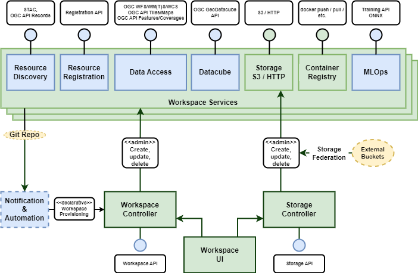

# Workspace Building Block

## Overview

The Workspace building-block provides a collection of resource management services that are scoped according to global (platform), project/group and user ownership. These services allow platform admins and users alike to exploit and maintain their owned resources in the platform.

The Workspace building-block comprises:

*	**Workspace Controller** 
  Platform-level API for administration of workspaces.
*	**Storage Controller** 
  User-level API for management of storage buckets.
*	**Workspace Services** 
  Comprising the extensible set of services instantiated within the scope of a project/user. Each such service can be regarded as a Component of the Workspace BB – noting that some are satisfied by building-blocks already identified in the architecture.
*	**Workspace UI** 
  Web-enabled user interface for the capabilities offered by the Workspace and Storage Controllers.

## Workspace Controller

The Workspace Controller provides the capability via an API for:

*	**Workspace Provisioning** 
  Platform administrators to maintain the lifecycle of Workspace instances, including: Create, Update, Delete.
*	**Workspace Utilisation** 
  Workspace owners to manage the services enabled within their workspace instance, and to obtain details for the workspace. 
  **_See also Workspace Provisioning Approach_**

## Workspace Provisioning Approach

We might consider supporting two approaches for Workspace owners to manage their workspace:

*	**Imperative** REST API with a semantic for requesting, configuring and maintaining the services provisioned within their workspace. 
  _This is the more traditional approach that is followed by the current EOEPCA Workspace API._
*	**Declarative (Gitops-style)** approach in which owner-managed configuration, maintained in Git, specifies the workspace services to be provisioned. 
  _This is beginning to emerge as a popular approach, in which Git is used to maintain the required configuration. In this case the workspace would be linked to a Git repository from where the workspace specification would be obtained. Commits to the Git repo are used to maintain the provisioned workspace Gitops-style._

In case the declarative approach is adopted, then the API is still required for read-only lookup of workspace details for runtime exploitation of the resources maintained within the workspace.

## Storage Controller

The Storage Controller provides the capability via an API for users to create and manage object storage buckets. Multiple buckets should be supported – each being individually identified with associated access credentials.

The API provides an interface for authorised users to list the available buckets and their associated details, such as bucket name, service URL and S3 access credentials.

Provides HTTP access to files in S3 object storage – for example using pre-signed URLs or similar techniques – such that the assets can be retrieved without need of an S3 client – including support for HTTP Range requests. This abstracts the underlying details of the object storage from the user of the data. Thus, the Storage Controller must integrate with the IAM BB in order to ensure that assets are only accessible for authorised users.

Similarly, an HTTP ‘upload’ capability should be provided that facilitates the push of assets into the object storage, allowing the caller to organise the assets into buckets and paths. These capabilities should integrate with the Resource Registration service and Resource Discovery such that asset metadata includes the HTTP-based access URLs.

The Storage Controller shall also support Storage Federation by allowing registration of existing Object Storage buckets (i.e. in external platforms) to be registered within the workspace – including all details required to access and use the bucket. This, for example, facilitates utilisation of external services for long-term storage.

## Workspace Services

Each Workspace provides a collection of related capabilities that are accessed via standard interfaces…

*	**Storage Access Interface** 
Interfaces through which data can be accessed and managed in buckets – including semantics for upload (put) and retrieval (get). 
Capabilities should be offered through the following interfaces for both retrieval and upload:
    *	**_Access via S3_** 
      Standard client interface for accessing object storage. Requires knowledge of the service URL and the associated credentials. 
      Full management capability via S3 client, such as s3cmd.
    *	**_Access via HTTP_** 
      For convenience, HTTP access can be provided to data in S3 buckets – either for public access or with appropriate access protections. 
      This capability is provided via the Storage Controller.
*	**Resource Discovery** 
  Workspace-scoped capabilities as offered by the Resource Discovery building-block – including support for all of the identified resource types. 
  Includes the capability to mark individual datasets as (optionally) deliverable via a selection of data access services.
*	**Resource Registration API** 
  REST API through which resources of all type can be registered into the Resource Discovery and Data Access services of the workspace. STAC [RD22] catalog/item are posted to the API to initiated registration – the outcome of which are metadata records added to the Resource Catalogue, and (optionally) provisioned within the data access services. 
  Resource registration is often (typically) preceded by ‘upload’ of resource assets into the storage buckets that are linked to the workspace – and referenced as STAC item assets.
*	**Data Access services** 
  Workspace-scoped capabilities as offered by the Data Access building-block. 
  The service offering is linked to that of the associated workspace Resource Discovery, in which the Datasets requiring data access service support will be marked as such in their metadata record.
*	**Datacube Access services** 
  Workspace-scoped access to Datacube resources – specifically those provided by the Datacube Access BB.
*	**MLOps services** 
  Workspace-scoped access to services for machine-learning model training and management training, including management of ML training data – specifically those provided by the MLOps BB.
*	**Container Registry** 
  Workspace-scoped storage and management of container images.

## Workspace UI

The Workspace UI provides a web-enabled user interface to the capabilities of the Workspace Controller and the Storage Controller, including…

*	administration of workspace lifecycles (create, list, update, delete)
*	management of workspace resources…
    *	management of storage bucket lifecycles (create, list, delete)
    *	management of storage buckets contents, including upload
    *	management of registered resources (create, list, update, delete)
    *	registration of DOI for registered resources
