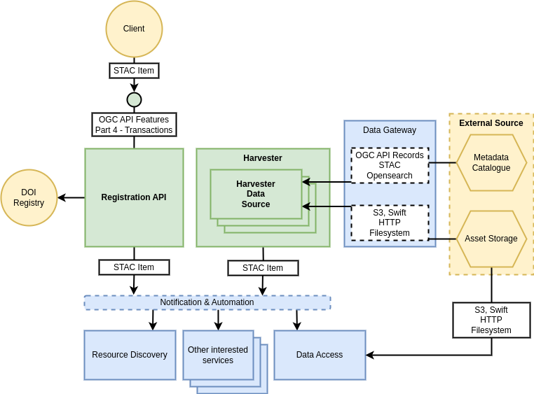

# Resource Registration Building Block

## Overview

Resource Registration supports the ingestion of data and its associated metadata into the platform services – including, but not limited to:

*	Metadata registration into Resource Discovery service
*	Data registration into Data Access services for data retrieval and visualisation

The Resource Registration building-block is a companion to Resource Discovery in terms of satisfying the ingestion of the resource types supported by Resource Discovery. Thus, it provides a RESTful service interface for registration of all the Resource Types identified in the [Resource Types][resource-types] section.

{: .centered}

## Components

On their own the capabilities of the building blocks cannot be exploited without provision of data within their services. Recognising the challenge of data integration within a heterogenous platform deployment – the reference architecture design identifies the need for building blocks to be extensible – by providing ‘hooks’ through which dedicated capabilities can be integrated to satisfy specific data integration needs.

Thus, the Resource Registration BB should, through modular design, be extensible for the datasets that are integrated for harvesting. This leads to an architecture in which the Resource Registration BB comprises a number of components.

### Registration API

**_For record Create, Update and Delete operations._**

We wish to define a standards-based interface for the registration of records into the platform. We define the OGC API Features Part 4 draft (Create, Replace, Update and Delete - Transactions) [[RD10]][rd10] interface for a REST API – relying upon STAC [[RD22]][rd22] items (Features) for the metadata model.

### Harvester

**_To ingest records from other (external) data sources._**

The Harvester proactively initiates and orchestrates the harvesting capability, and uses Harvester Data Source implementation to handle specific data sources.

### Harvester Data Source(s)

**_Provides an integration with a specific data source to provide customised support for record harvesting and interpretation, that is designed to be plugged-in to the Harvester for a given deployment._**

At minimum harvesting should be supported from the following sources for metadata: OGC API Records [[RD08]][rd08], STAC (static) [[RD22]][rd22], Opensearch [[RD24]][rd24].

At minimum registration of data assets should be supported from the following sources: S3 object storage, HTTP, Filesystem, Swift object storage.

#### Data Gateway Reuse

The implementation of the Harvester Data Source components may be partly or wholly met by the capabilities of the [**Data Gateway**][data-gateway-building-block] building block, that is designed to provide a reusable/extensible implementation that encapsulates the interface with the data providers.

## Registration into Building-blocks

The Resource Registration uses the Notification & Automation BB to initiate registration of the resources into interested building-blocks. Registration events are raised on the Notification & Automation BB – which will trigger building-blocks having expressed interest in specific resource types to ingest the metadata. In particular, the Resource Discovery building-blocks will subscribe to all resource types, that will be populated into the catalogue.

## DOI Management

Resource Registration supports the managements of DOI linked to resources. Thus, Resource Registration will integrate with an external service through which, upon user request, DOI can be minted, and the associated catalogue records updated with Resource Discovery to provide the DOI reference.
