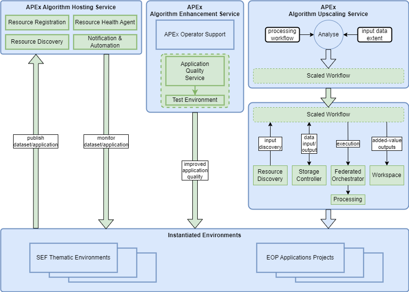

# Application Propogation Environment (APEx)

## Overview

This section presents the contribution of the EOEPCA building-blocks to the APEx architecture, as illustrated below…

{: .centered}

The main contribution of the EOEPCA building blocks is seen as for the APEx services for **Algorithm Hosting**, **Algorithm Enhancement** and **Algorithm Upscaling** – which are elaborated in the following sections. Also, for APEx Instantiation Services we also identify some possible opportunities.

## APEx Algorithm Hosting Service

Through its Instantiation Service, APEx will provide environments to support the development and execution in production of algorithms and processing workflows. The Algorithm Hosting Service is designed to persist the availability of the outcomes of such application projects beyond their completion.

The Algorithm Hosting Service is supported by the **Resource Discovery** and **Resource Registration** building-blocks providing a registry of hosted services, in which hosted applications are registered and published so that they are discoverable and available for reuse by other projects. Resource Registration will support establishing DOI for registered applications.

Application project outcomes will be persisted in Application Hosting environments that support their ongoing execution. The **Resource Health Agent** building-block supports routine health monitoring of both the hosting environments and the individual applications. Each hosted application will be configured in the Resource Health Agent building-block, that provides routine monitoring of the application to ensure that it is ‘live’ and in a healthy state. Through the Resource Health Agent, specific checks for each application can be defined to ensure that they are end-to-end executable. In addition, the Resource Health Agent will also support specification of checks performed against the Application Hosting environments themselves.

## APEx Algorithm Enhancement Service

The Algorithm Enhancement Service is a human-led APEx service that benefits from tooling to automate as much as possible the generalised approach to enhance processing workflow algorithms and bring them to production.

Applications hosted through the Algorithm Hosting Service should be engineered for reuse. The Application Quality BB provides a set of tooling that support the enforcement of coding best practices and software integrity. This includes tooling to perform automated code quality checks in accordance with best practice – including checks for reliability, maintainability, performance and security vulnerabilities. This is used in conjunction with the Notification & Automation BB that provides automation linked to git repository triggers.

## APEx Algorithm Upscaling Service

The Algorithm Upscaling Service supports the execution of processing algorithms across extended large-scale spatial and temporal extents. It is assumed that the upscaled execution is performed within the existing application hosting environment for the processing workflow. Thus, we assume that this environment, created via the APEx Instantiation Service, can support the required upscaling of the compute required to execute the bulk processing.

This capability requires to analyse the ‘input’ processing workflow and the requested data extent for execution – from which a processing workflow can be established for large-scale execution, which is parallelised as far as practical - appropriate to the granularity of the input data.

We can identify various Building Blocks that can play a role in this large-scale processing workflow:

* **Data Input/Output** 
  Resource Discovery - _Discovery of the input data for the full spatial/temporal extent._ 
  Storage Controller – _Pull/push of inputs, intermediate and output data._

* **Orchestrated Execution** 
  Federated Orchestrator – _Orchestration of the parallelised steps, possibly across multiple platform hosting environments, including the passing of data in/out of chained steps._ 
  Processing Engines/Runners - _It is assumed that the processing is to be executed in the (upscaled) environment(s) of the hosted application – which may include Processing Engines provided by the architecture._

* **Results Management** 
  Federated Orchestrator – _Aggregation of processing outputs into the Workspace._ 
  Workspace – _Storage of outputs within a dedicated collection._

## APEx Instantiation Service

**The Instantiation Service is mostly expected to be satisfied using existing platform services provided by existing NoR capabilities.**

Nevertheless, we may anticipate some areas where EOEPCA building-blocks may be of interest to platform providers offering their NoR service.

{: .centered}

Data hosting, discovery, access and visualization can be aided by the **Workspace BB**.

The **Application Hub** can provide tooling for interactive development, and support for dashboards and scientific storytelling.

In the case that the platform requires to expose its processing capabilities through interoperable standard interfaces, then these can be provided by the **Processing BBs**.

Application projects can be aided by the **Application Quality BB** to help their developed applications to follow best practices for open reproducible science, with provision of environments for test/optimisation.
