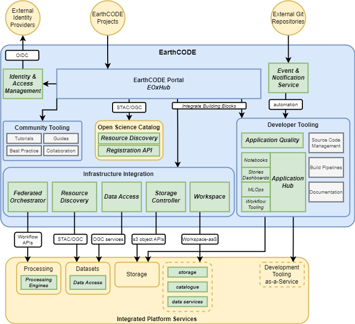

# EarthCODE

## Overview

EarthCODE provides a platform environment to support gold-standard best practice (for software development and resource management) FAIR open scientific development and research – with access to data, compute resources, services and tooling for development and community. EarthCODE comprises a portal as an entry point to development tooling facilitating FAIR Open Science through tooling for workflow and data management, supported by guides and tutorials to establish and communicate best practice. EarthCODE integrates access to external platform services for workflow execution, data, storage, and other platform resources, whose capabilities are made available through the EarthCODE platform offering.

This section presents the contribution of the EOEPCA building-blocks to the EarthCODE architecture, as summarised by the following figure…

!!! Key
    Green = EOEPCA BB |
    Blue = EarthCODE |
    Yellow = External integration |
    Grey = Not covered by building-blocks

{: .centered}

## Open Science Catalogue

The EarthCODE Portal enumerates the resources of all types that are available via the platform. This includes maintaining an index of all the available services, datasets, etc. integrated from external platform services. ESA’s Open Science Catalogue will be integrated with the Portal to provide this capability. The OSC currently includes an implementation of the EOEPCA Resource Catalogue. It is anticipated that the OSC will be evolved to support the EarthCODE requirements, including use of the **Resource Discovery** BB as defined in this architecture – not least to ensure that all resource types are supported. In addition, the OSC will be integrated with the **Resource Registration** BB for registration and maintenance of metadata records – including the ability to associate DOI with published resources, thus aiding citing and attribution in research.

## Processing Workflows

The EarthCODE Portal provides a layer that orchestrates access to the commercial platform services that are integrated with EarthCODE – providing users with all they need to support their workflows, including data, processing and storage. The Portal will be based on EOxHub, which includes some existing capabilities for integration with external platform services – specifically for processing and data. This capability should be evolved to accommodate the **Federated Orchestrator** to provide the cross-platform workflow capability. In doing so, we should anticipate some consolidation of capability between that which already exists within EOxHub and the emerging Federated Orchestrator implementation. There is also the possibility for EarthCODE to integrate with the APEx Upscaling Service to facilitate execution of large-scale processing workflows – a possibility that should be further analysed.

The Processing capabilities of the external platforms will be integrated on the basis of their provision of appropriate API interfaces – such as OGC API Processes [[RD05]][rd05]/[[RD06]][rd06], openEO [[RD19]][rd19], etc. In support of EarthCODE it is therefore anticipated that existing platforms may need to enhance and adapt their current capabilities to satisfy these integration interfaces. Thus, we can anticipate that the **Processing BBs** (in particular Engine and Runner components) may be reusable by the platform providers.

## Machine Learning

The MLOps BB provides tooling to support the development of Machine Learning models, including the management of ML training data and model artefacts. This will include integration with the Earth Observation Training Data Lab [[RD31]][rd31].

## Data Discovery and Access

External platform data offerings should be discoverable by standard interfaces – in particular STAC [RD22] and OGC API Records [RD08]. The **Resource Discovery** BB - via the Open Science Catalgue - specifically supports these standard interfaces, and should support harvesting and federation with external catalogues.

Standard interfaces for data access provide a common approach for consumption across data providers – including access to features (OGC API Features [[RD09]][rd09] / WFS [[RD11]][rd11]) and multi-dimensional data via WCS and through cloud-optimised formats (incl. COG, Zarr). Ideally the dataset offering should be supported by visualisation services through OGC WMS and WMTS interfaces. It is anticipated that existing platforms may need to enhance and adapt their current capabilities to satisfy these integration interfaces. Thus, we can anticipate that the **Data Access** BB may be reusable by the platform providers – or may be deployed within the EarthCODE platform environment to provide data access services for integrated platform data.

In addition, data assets held within platform object storage can be conveniently accessed via the **Storage Controller** capability that provides direct HTTP URLs to object storage resources (abstracting the S3 client interface). This is particularly important for cloud-optimised formats that are efficiently accessed with HTTP Range requests.

## Workspace

EarthCODE users/projects require services to support management of their ‘owned’ resources within the platform ecosystem. For example, to maintain uploaded data (as input to other platform activities, such as analytics) and processing/analytics results. The **Workspace Controller** and **Storage Controller** make this possible.

The Workspace Controller allows the provisioning of Workspaces that provide a set of services that are contextualised for the owning user/project. These services include Resource Discovery, Registration, Data Access, Container Registry – with associated storage buckets established via the Storage Controller. The Storage Controller allows projects to create and manage object storage buckets that are linked to their Workspace. This may include long-term storage capabilities, that are required to maintain all aspects of open science – including code, documentation, etc.

Together, the capabilities of the Workspace and Storage Controllers can be made available as platform Workspace-as-a-Service offerings and established within EarthCODE as Integrated Platform Services.

## Development Tooling

The **Application Quality** and **Application Hub** building-blocks contribute to the EarthCODE Development Tooling. The Portal seamlessly integrates the Development Tooling into the user experience, such that the user can effortlessly transition from development, through testing, to execution, and finally publishing of results, code and associated documentation. The Application Quality BB provides tools that can be integrated to automated development pipelines linked to the application source repositories – including code quality and vulnerability analysis. This can be seen as a continual iterative process, in which collaborators are able to contribute. The outcomes of the development, e.g. processing workflows, can then be configured and published via the **Workspace** and/or Open Science Catalogue (**Resource Discovery**) to be shared for reuse.

For data persistence, the Development Tooling should be integrated (backed) with long-term storage provided as an offering through the integrated platform services. This is facilitated by the **Storage Controller** to establish (or link to existing) buckets in integrated storage services.

## Interactive Dashboards

The EarthCODE Portal requires a capability that allows research and its outcomes to be published, showcased and utilised interactively. The **Application Hub** provides capabilities for projects to publish Scientific Stories and Interactive Dashboards that are linked to their Workspace and/or platform resources. These capabilities can be published through the EarthCODE Portal allowing results of scientific research to be published and interactively visualised, and so make the information easy to discover and consume.

## Community Tooling

The EarthCODE Portal also integrates community tooling, that provides a framework through which to create, host and publish information resources (tutorials, guides, best practices), and provides collaboration tools such as forums etc. It is not anticipated that this community tooling is covered by the building-blocks defined in the architecture.
